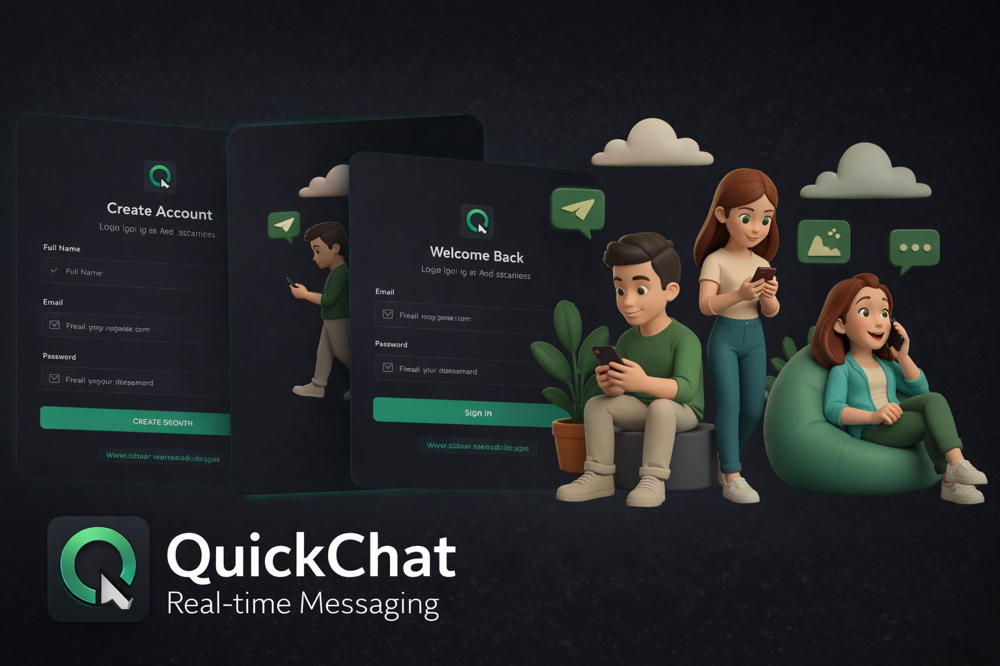

# QuickChat



QuickChat is a full-stack real-time messaging application built with the MERN stack. It delivers secure authentication, live conversations with Socket.IO, image sharing, typing indicators, online presence, and a polished mobile-friendly interface with PWA install support.

[Live Demo](https://quick-chat-production-984.up.railway.app/)

## Highlights

- Real-time one-to-one messaging with Socket.IO
- Authentication with JWT stored in secure cookies
- Contact discovery and recent chats view
- Online users tracking
- Typing indicators
- Image sharing in conversations with Cloudinary
- Profile picture update and account deletion
- Welcome email flow with Resend
- Rate-limited API endpoints for auth, profile updates, and messaging
- Responsive UI built with React, Tailwind CSS, and DaisyUI
- PWA support for installable app experience

## Tech Stack

**Frontend**

- React 19
- Vite
- React Router
- Zustand
- Tailwind CSS
- DaisyUI
- Socket.IO Client
- Axios
- Vite PWA

**Backend**

- Node.js
- Express
- MongoDB with Mongoose
- Socket.IO
- JWT Authentication
- bcryptjs
- Cloudinary
- Resend
- Express Rate Limit

## Project Structure

```text
QuickChat/
|-- backend/
|   |-- src/
|   |   |-- controllers/
|   |   |-- lib/
|   |   |-- middleware/
|   |   |-- models/
|   |   |-- routes/
|   |   `-- server.js
|-- frontend/
|   |-- public/
|   `-- src/
`-- README.md
```

## Environment Variables

Create a `.env` file inside `backend/`:

```env
PORT=3000
MONGO_URI=your_mongodb_connection_string
JWT_SECRET=your_jwt_secret
CLIENT_URL=http://localhost:5173
NODE_ENV=development

RESEND_API_KEY=your_resend_api_key
EMAIL_FROM=your_sender_email
EMAIL_FROM_NAME=QuickChat

CLOUDINARY_NAME=your_cloudinary_cloud_name
CLOUDINARY_API_KEY=your_cloudinary_api_key
CLOUDINARY_API_SECRET=your_cloudinary_api_secret
```

## Installation

```bash
npm install
cd backend && npm install
cd ../frontend && npm install
```

## Run Locally

Open two terminals:

**Backend**

```bash
cd backend
npm run dev
```

**Frontend**

```bash
cd frontend
npm run dev
```

Frontend runs on `http://localhost:5173` and the backend runs on `http://localhost:3000`.

## Production Build

From the project root:

```bash
npm run build
npm start
```

This installs backend and frontend dependencies, builds the frontend, and serves the production app through the backend server.

## Core Features

- Sign up, log in, log out, and session restore
- Real-time message delivery
- Sound notification support
- Optimistic UI for outgoing messages
- Chat history and conversation deletion
- Profile avatar upload and cleanup
- Installable web app experience

## API Overview

**Auth**

- `POST /api/auth/signup`
- `POST /api/auth/login`
- `POST /api/auth/logout`
- `GET /api/auth/verify`
- `PUT /api/auth/update-profile`
- `DELETE /api/auth/delete-profile`

**Messages**

- `GET /api/messages/contacts`
- `GET /api/messages/chats`
- `GET /api/messages/:id`
- `POST /api/messages/send/:id`
- `DELETE /api/messages/chats/:id`

## Deployment

The current deployed version is available at:

`https://quick-chat-production-984.up.railway.app/`

For deployment, make sure the backend environment variables are configured correctly and `CLIENT_URL` matches the frontend domain.

## Author

**Muhammad Faras**

GitHub: [mfaras94](https://github.com/mfaras94)
